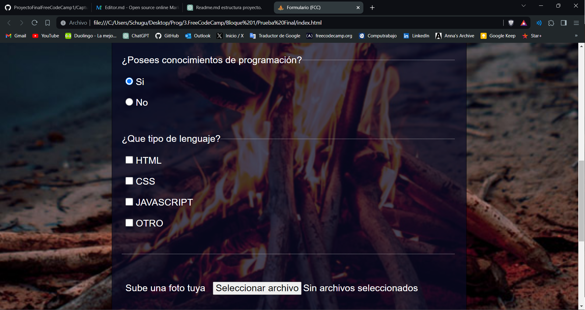
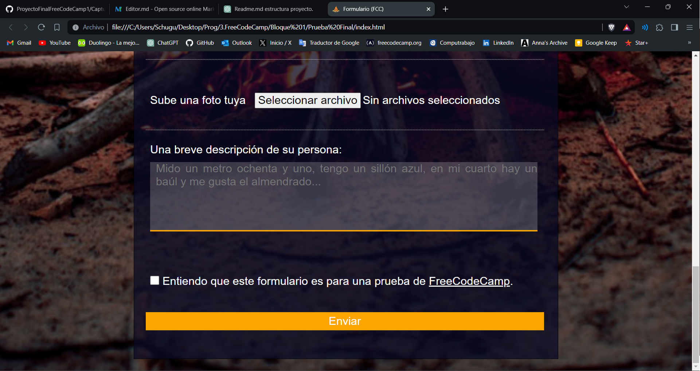

<h1 align='center'>Proyecto final N°1 del curso Responsive Web Design de FreeCodeCamp</h1>

> Este proyecto es 1/5 para la certificación del curso.

## Página formulario:
Objetivo: Construir una aplicación que sea funcionalmente similar a https://survey-form.freecodecamp.rocks. No copiar este proyecto de demostración.

### Historias de usuario (Descripción): 
1. Debes tener un título de página en un elemento <code>h1</code> con un <code>id</code> de <code>title</code>.
2. Debes tener una corta explicación en el elemento <code>p</code> con un <code>id</code> de <code>description</code>.
3. Debes tener un elemento <code>form</code> con un <code>id</code> de <code>survey-form</code>.
4. Dentro del elemento <code>form</code>, debe ser requerido ingresar tu nombre en un campo de entrada que tenga un <code>id</code> de <code>name</code> y un tipo de texto.
5. Dentro del elemento <code>form</code>, debe ser requerido ingresar tu correo electrónico en un campo de entrada que tenga un <code>id</code> de <code>email</code>.
6. Si ingresas un correo electrónico que no tenga el formato correcto, verás un error de validación HTML5.
7. Dentro del formulario, puedes ingresar un número en un campo de entrada que tenga un <code>id</code> de <code>number</code>.
8. La entrada de números no debe aceptar caracteres no numéricos, ya sea impidiendo que los escribas o mostrando un error de validación HTML5 (dependiendo del navegador).
9. Si ingresas un número que esté fuera del rango de números permitido, definido por los atributos <code>min</code> y <code>max</code>, verás un error de validación de HTML5.
10. Para los campos de entrada de nombre, correo electrónico y número, puedes ver los correspondientes elementos <code>label</code> en el formulario, que describen el propósito de cada campo con los siguientes <code>id</code>: <code>id="name-label"</code>, <code>id="email-label"</code> e <code>id="number-label"</code>.
11. Para los campos de entrada de nombre, correo electrónico y número, podrás ver un texto provisional que da una descripción o instrucciones para cada campo.
12. Dentro del elemento <code>form</code>, debes tener un elemento desplegable <code>select</code> con un <code>id</code> de <code>dropdown</code> con al menos dos opciones para elegir.
13. Dentro del elemento <code>form</code>, puedes seleccionar una opción de un grupo de al menos dos botones de radio que están agrupados utilizando el atributo <code>name</code>.
14. Dentro del elemento <code>form</code>, puedes seleccionar varios campos en una serie de casillas de verificación, cada una debe tener un atributo <code>value</code>.
15. Dentro del elemento <code>form</code>, se te presenta un <code>textarea</code> para comentarios adicionales.
16. Dentro del elemento <code>form</code>, se te presenta un botón con un <code>id</code> de <code>submit</code> para enviar todas las entradas.

### Pruebas (Pruebas Técnicas a pasar): 
- 🧪 Debes tener un elemento <code>h1</code> con un <code>id</code> de <code>title</code>.
- 🧪 Tu <code>#title</code> no debe estar vacío.
- 🧪 Debes tener un elemento <code>p</code> con un <code>id</code> de <code>description</code>.
- 🧪 Tu <code>#description</code> no debe estar vacío.
- 🧪 Debes tener un elemento <code>form</code> con un <code>id</code> de <code>survey-form</code>.
- 🧪 Debes tener un elemento <code>input</code> con un <code>id</code> de <code>name</code>.
- 🧪 Tu <code>#name</code> debe tener un <code>type</code> de texto.
- 🧪 Tu <code>#name</code> debe requerir una entrada.
- 🧪 Tu <code>#name</code> debe ser descendiente de <code>#survey-form</code>.
- 🧪 Debes tener un elemento <code>input</code> con un <code>id</code> de <code>email</code>.
- 🧪 Tu <code>#email</code> debe tener un <code>type</code> de email.
- 🧪 Tu <code>#email</code> debe requerir una entrada.
- 🧪 Tu <code>#email</code> debe ser descendiente de <code>#survey-form</code>.
- 🧪 Debes tener un elemento <code>input</code> con un <code>id</code> de <code>number</code>.
- 🧪 Tu <code>#number</code> debe ser descendiente de <code>#survey-form</code>.
- 🧪 Tu <code>#number</code> debe tener un <code>type</code> de number.
- 🧪 Tu <code>#number</code> debe tener un atributo <code>min</code> con un valor numérico.
- 🧪 Tu <code>#number</code> debe tener un atributo <code>max</code> con un valor numérico.
- 🧪 Debes tener un elemento <code>label</code> con un <code>id</code> de <code>name-label</code>.
- 🧪 Debes tener un elemento <code>label</code> con un <code>id</code> de <code>email-label</code>.
- 🧪 Debes tener un elemento <code>label</code> con un <code>id</code> de <code>number-label</code>.
- 🧪 Tu <code>#name-label</code> debe contener un texto que describa la entrada.
- 🧪 Tu <code>#email-label</code> debe contener un texto que describa la entrada.
- 🧪 Tu <code>#number-label</code> debe contener un texto que describa la entrada.
- 🧪 Tu <code>#name-label</code> debe ser descendiente de <code>#survey-form</code>.
- 🧪 Tu <code>#email-label</code> debe ser descendiente de <code>#survey-form</code>.
- 🧪 Tu <code>#number-label</code> debe ser descendiente de <code>#survey-form</code>.
- 🧪 Tu <code>#name</code> debe tener el atributo <code>placeholder</code> y un valor.
- 🧪 Tu <code>#email</code> debe tener un atributo <code>placeholder</code> y un valor.
- 🧪 Tu <code>#number</code> debe tener un atributo <code>placeholder</code> y un valor.
- 🧪 Debes tener un campo <code>select</code> con un <code>id</code> de <code>dropdown</code>.
- 🧪 Tu <code>#dropdown</code> debe tener al menos dos elementos <code>option</code> seleccionables (no deshabilitados).
- 🧪 Tu <code>#dropdown</code> debe ser descendiente de <code>#survey-form</code>.
- 🧪 Debes tener al menos dos elementos <code>input</code> con un <code>type</code> de radio (botones de radio).
- 🧪 Debes tener al menos dos botones de radio que sean descendientes de <code>#survey-form</code>.
- 🧪 Todos tus botones de radio deben tener un atributo <code>value</code> y un valor.
- 🧪 Todos tus botones de radio deben tener un atributo <code>name</code> y un valor.
- 🧪 Cada grupo de botón de radio debe tener al menos 2 botones de radio.
- 🧪 Debes tener al menos dos elementos <code>input</code> con un <code>type</code> de checkbox (casillas de verificación) que sean descendientes de <code>#survey-form</code>.
- 🧪 Todos tus casillas de verificación dentro de <code>#survey-form</code> deben tener un atributo <code>value</code> y un valor.
- 🧪 Debes tener al menos un elemento de <code>textarea</code> que sea descendiente de <code>#survey-form</code>.
- 🧪 Debes tener un elemento <code>input</code> o <code>button</code> con un <code>id</code> de <code>submit</code>.
- 🧪 Tu <code>#submit</code> debe tener un <code>type</code> de submit.
- 🧪 Tu <code>#submit</code> debe ser descendiente de <code>#survey-form</code>.

### Capturas de pantalla: 

